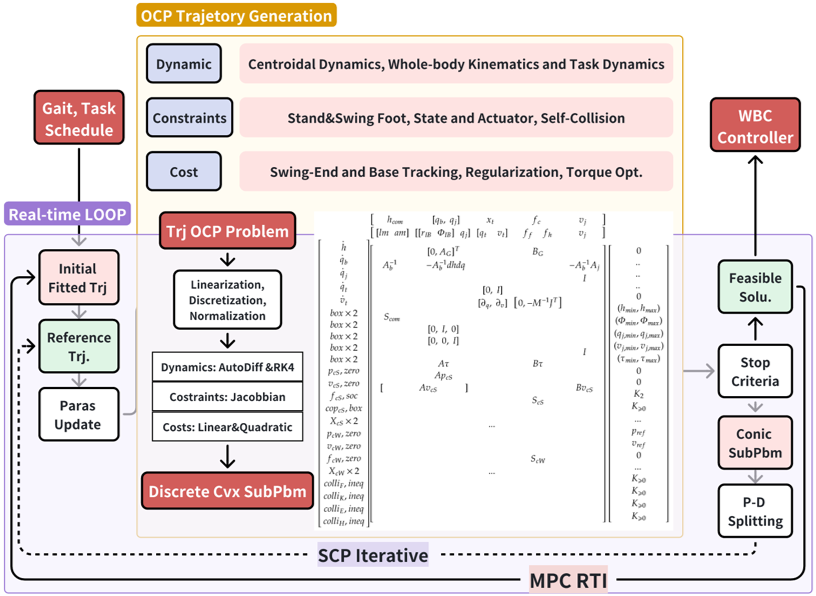
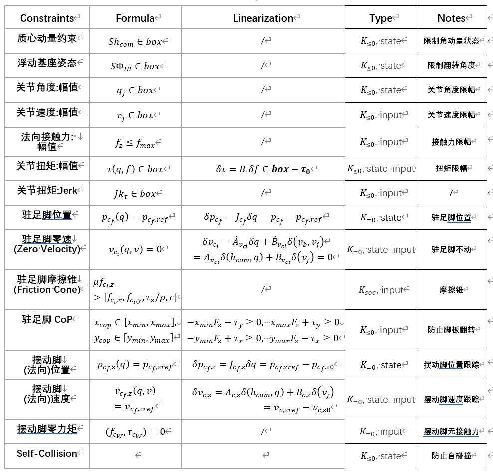
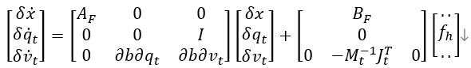

## I. Introduction

When humanoid robots perform tasks such as moving goods, opening doors
and so on, upper-limb manipulation will significantly affect overall
balance. Therefore, the project introduces **Full Loco-Manipulation
Model** (**FLM)** as Sleiman et al. proposed, including **centroidal
dynamics, whole-body kinematics and operation dynamics** [1]. A single
multi-contact OCP is formulated and a **real-time transcription and
solver** are being developed based on **sequential convex programming**.

The project's infrastructure mainly refers to wb_humanoid_mpc [2] and
OCS2 [4]. However, the "full centroidal model" in OCS2 **directly
performs automatic differentiation on FLM**, which would lead to
**increased computational complexity and larger tape size** from CppAD,
due to the mixing of matrix inversions, CMM recursive algorithm and CoM
momentum's partial derivative.

## II Model of Full Loco-Manipulation Model

Loco-Manipulation requires simultaneous planning of the center of mass,
gait, and arm movements; therefore, its dynamic equation must
incorporate centroidal dynamics, whole-body kinematics, and task
dynamics.

Locomotion needs to **meet various constraints** required for **lower
limb gait tracking and dynamic balance**, and mainly consists of the
following components:
1. **Foot contact constraints**, such as the friction cone and zero velocity 
    of the standing foot; zero wrench and normal position& of the swinging foot; 
2. **Foot placement constraints**, strictly satisfying the terminal foot placement 
    and corresponding whole-body pose determined by upper-level perception and Gait Schedule.
3. **State and Actuator constraints**: strictly adhere to the range of position 
    and speed amplitudes, torque amplitudes, and slopes of the joint servo motor.

Locomotion uses a **quadratic cost to track gait trajectories**
generated offline and fitted online, **penalize deviations** from the
default humanoid posture, and **optimize the impact** of contact forces
and execution costs. Therefore, it typically consists of the following
components:
1. **Foot swing and base tracking** $e_{cW} = p_{cW} - p_{ref}$ ;
2. **Regularization Penalty** $e_{nol} = q - q_{ref}$ ;
3. **Quadratic optimization for control inputs** $L_{\tau} = \tau^T P_{\tau} \tau$ ;
4. **ICP regularization** $e_{ICP} = p_{com} - p_{SS}$

Similar to Locomotion, Manipulation also requires the addition of
constraints and costs to satisfy the physical laws of hand contact and
to complete upper limb manipulation tasks.

### 2.1 Full Loco-Manipulation Model

<b>State Vector</b>: The state includes CoM momentum $h_{com} = [lm_{com}, am_{com}] \in \mathbb{R}^6$ at Frame $G_{LWA}$, floating base position $q_b = [r_{IB}, \Phi_{IB}] \in \mathbb{R}^6$ at Frame $B_{LWA}$, and Joint position $q_j \in \mathbb{R}^{n_a}$. The total state vector is $[h_{com}, q_b, q_j] \in \mathbb{R}^{12+n_a}$ .

<b>Control Input</b>: The inputs are contact forces $f = [f_c, \tau_c] \in \mathbb{R}^6$ (specifically $[f_{fl}, f_{fr}, f_{hl}, f_{hr}]$) and joint velocity $v_j \in \mathbb{R}^{n_a}$ .

Other Variables: These include contact point location $p_{ci}(q)$, CoM position $p_{com}(q)$, floating base speed $v_b = [lv_{IB}, av_{IB}]$ , and contact speeds $v_{ci}(v)$ where $v = [v_b, v_j] = [\dot{q}_b, \dot{q}_j]$ .

Note on Floating Base Speed: Whole-body motion planning does not incorporate floating base speed $v_b$ as a state. Instead of using it as a control input, the nonlinear relationship is directly modeled with the first-order derivative $v_b$ and $(h_{com}, q_j)$25. Therefore, when considering the first-order linearization of contact point velocity $v_{ci}(v)$ relative to $\delta(v_b, v_j)$, the differential chain rule is needed to indirectly obtain the Jacobian coefficient relative to $\delta(h_{com}, q_j)$

##### 2.1.1 CoM Dynamics

$${\dot{\mathbf{h}}}_{\mathbf{com}}\mathbf{=}\begin{bmatrix}
\sum_{\mathbf{i = 1}}^{\mathbf{n}_{\mathbf{c}}}\mathbf{f}_{\mathbf{c}_{\mathbf{i}}}\mathbf{+ mg} \\
\sum_{\mathbf{i = 1}}^{\mathbf{n}_{\mathbf{c}}}{\left( \mathbf{p}_{\mathbf{c}_{\mathbf{i}}}\left( \mathbf{q} \right)\mathbf{-}\mathbf{p}_{\mathbf{com}}\mathbf{(q)} \right)\mathbf{\times}\mathbf{f}_{\mathbf{ci}}\mathbf{+}\mathbf{\tau}_{\mathbf{c}_{\mathbf{i}}}}
\end{bmatrix}$$

The CoM dynamics equations, in the WORLD coordinate system, describe
relationship between external contact forces and the center-of-mass
momentum. They neglect the robot's internal pose and velocity, focusing
only on the external force state.
$r_{c_{i}} = p_{c_{i}}(q) - p_{com}(q)$, the location of the contact
point and CoM are nonlinear relationship with
$q = [ q_{b},q_{j} ]$described by the SE(3)
transformation.

##### 2.1.2 Whole-body kinematics

Full-body motion planning requires not only planning contact forces and
center-of-mass momentum, but also the position and velocity of each limb
and floating base that forms CoM position and momentum. Therefore, it is
necessary to introduce the kinematic equations of the center of mass,

$$h_{com} = \left\lbrack A_{b}(q),\ A_{j}(q) \right\rbrack\begin{bmatrix}
{\dot{q}}_{b} \\
{\dot{q}}_{j}
\end{bmatrix}$$

$${\dot{q}}_{b} = A_{b}^{- 1}(q)(h_{com} - A_{j}(q){\dot{q}}_{j})$$

$A(q) \in R^{6 \times (6 + n_{a})}$ is Centroidal Momentum Matrix (CMM),
obtained recursively by the CCRBA algorithm.

##### 2.1.3 Task dynamics

In manipulation tasks, heavy operation tasks will significantly react against the robot itself, 
leading to instability or task failure (e.g., carrying heavy objects, pushing/pulling spring doors). 
The dynamics of the manipulated object can be categorized and estimated via perception and priors. 
Therefore, Loco-Manipulation modeling must include the dynamics and planning of the manipulation task.

Task State: $x_t = [q_t, v_t] \in \mathbb{R}^6$ .
Control Input: The contact points of both hands .
Object Dynamics:

$$\dot{x}_t = \begin{bmatrix} v_t \\ M_t^{-1}(-J_t^T f_t - b_t) \end{bmatrix}$$ 

Where $v_t$ is the object velocity, $M_t$ is the object inertia matrix, $J_t$ is the object contact force mapping matrix, 
$b_t$ represents forces related to position and velocity (e.g., spring force, friction), 
and $f_t = [f_{hl}, f_{hr}]$ constitutes the reaction forces and torques 
applied by the hands to the object.

### 2.2 Constraints Summary

In addition to centroidal dynamics and whole-body kinematics equality constraints, 
constraints are required for lower limb gait tracking, 
dynamic balance (foot contact/terminal state), and actuator limits (mechanical/motor).

### 2.3 Cost Summary

Locomotion employs quadratic costs to track trajectories, 
penalize deviation from the default pose, and optimize impact/execution costs.

## III. Transcription of Full Loco-Manipulation Model

### 3.1 Transcription of Full Loco-Manipulation Model

##### 3.1.1 Transcription of CoM Dynamics

Differentiate the angular momentum and linear momentum separately,
noting that the differential of position is the same as the Jacobian
matrix of velocity,

$$\delta\dot{am} = = \left\lbrack f_{c_{i}} \right\rbrack_{\times}^{T}\left( J_{c_{i}} - J_{com} \right)\begin{bmatrix}
\delta q_{b} \\
\delta q_{j}
\end{bmatrix} + \lbrack r_{c \times},\ I\rbrack\begin{bmatrix}
\delta f_{c_{i}} \\
\delta\tau_{c_{i}}
\end{bmatrix}$$

$$\delta\dot{lm} = I_{fl}\begin{bmatrix}
\delta f_{c} \\
\delta\tau_{c}
\end{bmatrix} + I_{fr}\begin{bmatrix}
\delta f_{c} \\
\delta\tau_{c}
\end{bmatrix} + \ldots$$

Considering only the relevant state and control inputs, the linearized
state equation is

$$\begin{bmatrix}
\delta\dot{lm} \\
\delta\dot{am}
\end{bmatrix} = \begin{bmatrix}
0 \\
A_{G}
\end{bmatrix}\begin{bmatrix}
\delta q_{b} \\
\delta q_{j}
\end{bmatrix} + B_{G}\begin{bmatrix}
\begin{matrix}
(\delta f_{c,fl},\ \delta\tau_{c,fl}) & \delta f_{fr}
\end{matrix} & \begin{matrix}
\delta f_{hl} & \delta f_{hr}
\end{matrix}
\end{bmatrix}^{T}$$

##### 3.1.2 Transcription of Whole-body kinematics

Differentiating the equation,

$$\delta{\dot{q}}_{b} = \frac{\partial v_{b}}{\partial h}\delta h_{com} + \frac{\partial v_{b}}{\partial{\dot{q}}_{j}}\delta{\dot{q}}_{j} + \frac{\partial v_{b}}{\partial q}\delta q = A_{b}^{- 1}\delta h_{com} - A_{b}^{- 1}A_{j}\delta{\dot{q}}_{j} - A_{b}^{- 1}\frac{\partial h_{com}}{\partial q}\delta q$$

$$\frac{\partial v_{b}}{\partial q} = - A_{b}^{- 1}\frac{\partial h_{com}}{\partial q}$$

Therefore, kinematic linearization requires first calculating the
partial derivative of CoM momentum with respect to joint position
$dhdq$, which recursive algorithms can achieve
$O(N^{2})$complexity.

Although the automatic differential can be calculated directly,
combining above theoretical formulas and analytical methods is more
effective. Considering only the relevant states and control inputs, the
linearized state equation is

$$\left\lbrack \delta{\dot{q}}_{b} \right\rbrack = \begin{bmatrix}
A_{b}^{- 1} & - A_{b}^{- 1}dhdq\ 
\end{bmatrix}\begin{bmatrix}
\delta h_{com} \\
\delta q_{b} \\
\delta q_{j}
\end{bmatrix} + \lbrack 0,\ \ \  - A_{b}^{- 1}A_{j}\rbrack\begin{bmatrix}
\delta f \\
\delta{\dot{q}}_{j}
\end{bmatrix}$$

$$A_{B} = \begin{bmatrix}
A_{b}^{- 1} & - A_{b}^{- 1}dhdq\ 
\end{bmatrix},\ \ \ B_{B} = \lbrack 0,\ \ \  - A_{b}^{- 1}A_{j}\rbrack$$

##### 3.1.3 Transcription of Task dynamics

Considering only relevant states and control inputs, the linearized state equation is:

$$\begin{bmatrix} \delta \dot{q}_t \\ \delta \dot{v}_t \end{bmatrix} = \begin{bmatrix} 0 & I \\ \frac{\partial -M_t^{-1}b_t}{\partial q_t} & \frac{\partial -M_t^{-1}b_t}{\partial v_t} \end{bmatrix} \begin{bmatrix} \delta q_t \\ \delta v_t \end{bmatrix} + \begin{bmatrix} 0 \\ -M_t^{-1}J_t^T \end{bmatrix} \delta f_h$$

This forms the system $\dot{x}_t = A_T \delta x_t + B_T \delta f_h$.

$${\begin{bmatrix}
\delta{\dot{q}}_{t} \\
\delta{\dot{v}}_{t}
\end{bmatrix} = \begin{bmatrix}
0 & I \\
\frac{\partial\left( - M_{t}^{- 1}b_{t} \right)}{\partial q_{t}}\  & \frac{\partial\left( - M_{t}^{- 1}b_{t} \right)}{\partial v_{t}}\ 
\end{bmatrix}$$

$$\begin{bmatrix}
\delta q_{t} \\
\delta v_{t}
\end{bmatrix} + \left\lbrack - M_{t}^{- 1}J_{t}^{T} \right\rbrack\left\lbrack \delta f_{h} \right\rbrack
}{{\dot{x}}_{t} = A_{T}\delta\left( x_{t} \right) + B_{T}\delta\left( f_{h} \right)}$$

##### 3.1.4 Dynamics Transcription Summary

If task dynamics are not considered, then

$$\begin{bmatrix}
\delta{\dot{h}}_{com} \\
\delta{\dot{q}}_{b} \\
\delta{\dot{q}}_{j}
\end{bmatrix} = \begin{bmatrix}
0 & \begin{bmatrix}
0 \\
A_{G}
\end{bmatrix} \\
A_{b}^{- 1} & - A_{b}^{- 1}dhdq \\
0 & 0
\end{bmatrix}\begin{bmatrix}
\delta h_{com} \\
\begin{bmatrix}
\delta q_{b} \\
\delta q_{j}
\end{bmatrix}
\end{bmatrix} + \begin{bmatrix}
B_{G} & 0 \\
0 & - A_{b}^{- 1}A_{j} \\
0 & I
\end{bmatrix}\begin{bmatrix}
\delta f \\
\delta{\dot{q}}_{j}
\end{bmatrix}$$

If task dynamics are not considered:

$$\begin{bmatrix} \delta \dot{h}_{com} \\ \delta \dot{q}_b \\ \delta \dot{q}_j \end{bmatrix} = \begin{bmatrix} 0 & 0 & A_G \\ A_b^{-1} & -A_b^{-1}\frac{dh}{dq} & 0 \\ 0 & 0 & 0 \end{bmatrix} \begin{bmatrix} \delta h_{com} \\ \delta q_b \\ \delta q_j \end{bmatrix} + \begin{bmatrix} B_G & 0 \\ 0 & -A_b^{-1}A_j \\ 0 & I \end{bmatrix} \begin{bmatrix} \delta f \\ \delta \dot{q}_j \end{bmatrix}$$

$$\delta \dot{x}_F = A_F \delta x_F + B_F \delta u$$

Where $x_F$ has dimension $12+n_a$, $A_F$ is $(12+n_a) \times (12+n_a)$, $u$ is $24+n_a$, and $B_F$ is $(12+n_a) \times (24+n_a)$.One can see large zero blocks in the equation, indicating that sparse matrix storage should be used.

Considering manipulation task dynamics:

$$\delta \dot{x} = A \delta x + B \delta u$$

## IV. Real-time Implementations

Moreover, wb_humanoid_mpc adopts OCS2's "SQP" method with HPIPM solver,
in which Riccati Recursion algorithm is highly efficient through ZOH
discretization's sparse pattern. In my opinion, too many discrete
nodes - up to 60 with 1.2s horizon and 20ms step size -- lead to **a
huge convex subproblem, especially with many constraints**, in order to
meet ZOH's assumption that variables in each interval remain constant.
Besides, HPIPM **can't handle second-order cone (SOC)** constraints like
friction cone, and several **hard constraints** are **converted into
soft costs** (not sure reason).

In contrast, the project gives derivatives of centroidal dynamics and
whole-body kinematics through **theoretical derivation for hand-parser**
and will implement **SCP with a first-order primal-dual solver**
supports FOH discretization and SOC, resulting in **fewer nodes** (20
nodes in 1s horizon) and **smoother trajectory** (piecewise continuous).
Meanwhile a **customized solver** of fixed sparse pattern could be
comparable in speed to HPIPM. Though this requires a **fixed-structure
problem**, the engineering design of **static pre-allocation** for
maximum size is ideal for loco-manipulation tasks, where all constraints
and objectives are pre-modeled, then selectively activated by specific
problem or states.

Refer directly to <Computational Trajectory Generation> and
[**CTrjGen.jl**](https://github.com/QingtanZeng/CTrjGen.jl)[5].

## V. Reference

[1] Sleiman, J. P., Farshidian, F., Minniti, M. V., & Hutter, M.
(2021). A unified mpc framework for whole-body dynamic locomotion and
manipulation. IEEE Robotics and Automation Letters, 6(3), 4688-4695. \
[2] Manuel Yves Galliker, Whole-body Humanoid MPC: Realtime
Physics-Based Procedural Loco-Manipulation Planning and Control,
\[<https://github.com/1x-technologies/wb_humanoid_mpc>\]. \
[3] Carpentier, J., & Mansard, N. (2018, June). Analytical derivatives
of rigid body dynamics algorithms. In Robotics: Science and systems (RSS
2018). \
[4] Farshidian, F. (2023). OCS2: An open-source library for optimal
control of switched systems. Accessed: May, 23. \
[5] Qingtan Zeng, Computational Trajectory Generation,
\[<https://github.com/QingtanZeng/CTrjGen.jl>\]